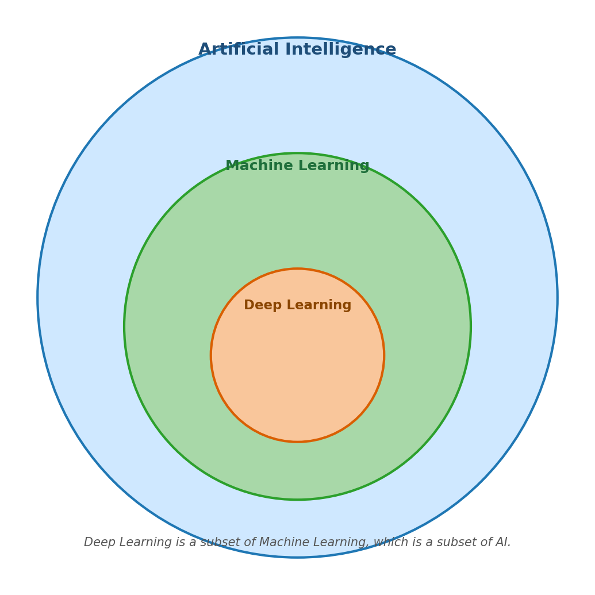
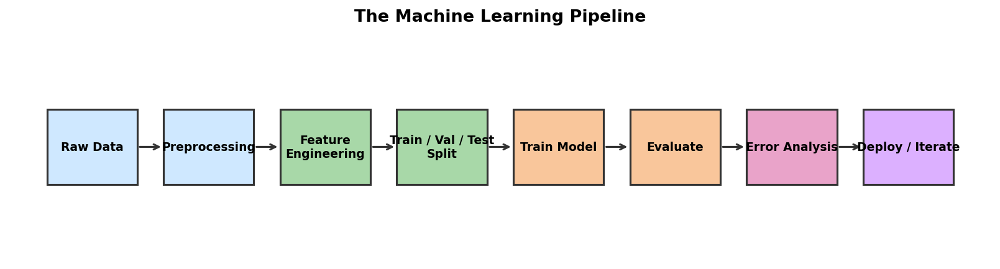

# Chapter 0: Course Introduction

## 1. Learning Objectives

After this chapter, you will be able to:

- Explain how Machine Learning differs from traditional programming.
- Describe the relationship between Artificial Intelligence, Machine Learning, and Deep Learning.
- Identify whether a problem is a candidate for ML, and when it is not.
- Outline a basic ML pipeline: data → model → loss → optimization → evaluation.
- Navigate this repository — find chapter notes, notebooks, assignments, labs, and projects.

## 2. Motivation and Intuition

Traditional programming asks a human to write down explicit rules:

> "If the email contains the word `lottery`, flag it as spam."

This works fine when the rules are crisp. It breaks down the moment the rules drift, multiply, or live in fuzzy, high-dimensional data (text, images, audio, click streams). Try writing a rule that tells a cat from a dog using raw pixels — you can't, not really.

Machine Learning flips the loop. Instead of writing rules by hand, you give the computer many examples (data) and a recipe for measuring success (a loss function). The computer searches for the rule (the model parameters) that best fits the examples. It learns the rule from the data, not from you.

Three things happen in the background:

1. You pick a model family — a parameterized class of functions, e.g. "all straight lines."
2. You define a loss — a way to score how badly a candidate rule fits the data.
3. You run optimization — find parameter values that minimize the loss.

That's the whole game. Every algorithm in this course is a different choice of model + loss + optimizer.

## 3. Core Theory

### 3.1 AI ⊇ ML ⊇ DL

- **Artificial Intelligence (AI)** — the broad goal of building systems that perform tasks usually requiring human intelligence: planning, perception, language, reasoning.
- **Machine Learning (ML)** — a subset of AI. Systems that improve at a task by being exposed to data, *without being explicitly programmed for that task*.
- **Deep Learning (DL)** — a subset of ML. Models built from many layers of differentiable transformations (deep neural networks).

Not every AI system is ML — a chess engine written with hand-crafted rules is still AI. Not every ML system is DL — linear regression, KNN, and decision trees are classical ML, not deep learning.

### 3.2 The four pillars of an ML system

Every ML model you will meet in this course is some combination of:

| Pillar       | What it is                                                | Examples                            |
|--------------|-----------------------------------------------------------|-------------------------------------|
| **Data**     | $N$ samples, each a feature vector $\mathbf{x}^{(i)}$ and (often) a label $y^{(i)}$ | Iris flowers + species               |
| **Model**    | A parametric function $f_{\boldsymbol{\theta}}: \mathbf{x} \mapsto \hat{y}$         | $\hat{y} = \mathbf{w}^\top \mathbf{x} + b$ |
| **Loss**     | A scalar telling how wrong the model is on the data        | $\mathcal{L} = \frac{1}{N}\sum_i (y^{(i)} - \hat{y}^{(i)})^2$ |
| **Optimizer**| A procedure for moving $\boldsymbol{\theta}$ in a direction that lowers $\mathcal{L}$ | gradient descent                    |

### 3.3 Common ML problem types

| Type                 | Goal                                            | Output type                    | Example                                |
|----------------------|-------------------------------------------------|-------------------------------|----------------------------------------|
| Regression           | Predict a continuous value                       | $\hat{y} \in \mathbb{R}$       | House-price prediction                  |
| Binary classification| Predict one of two classes                       | $\hat{y} \in \{0, 1\}$         | Spam vs. ham                            |
| Multi-class classification | Predict one of $K$ classes                | $\hat{y} \in \{1, \dots, K\}$  | Digit recognition                       |
| Clustering           | Group similar samples (no labels)                | cluster id                     | Customer segmentation                   |
| Dimensionality reduction | Compress features while preserving structure | lower-dim vector              | Visualizing high-d data in 2D           |
| Recommendation       | Predict items a user will like                   | ranked list                    | Movie recommendations                   |

### 3.4 The ML pipeline

Pipeline stages, in order:

1. **Raw data** — collect or load it. Document where it came from.
2. **Preprocessing** — clean, deduplicate, handle missing values.
3. **Feature engineering** — turn raw inputs into representations the model can use.
4. **Train / validation / test split** — set aside disjoint subsets so you can honestly measure generalization.
5. **Train model** — fit parameters by minimizing the loss on the training set.
6. **Evaluate** — compute metrics on the validation (during development) and test (final reporting) sets.
7. **Error analysis** — inspect mistakes, look for patterns, learn what to improve.
8. **Deploy / iterate** — ship the model, monitor it, retrain when it drifts.

This loop will reappear at the end of every chapter. By the time we reach the final project, you will have walked through it many times.

## 4. Algorithm or Pipeline

Not applicable in this introduction chapter — we are setting context, not implementing an algorithm. Subsequent chapters all include pseudo-code in this section.

## 5. Python Practice

No notebook for this chapter. Open `notebooks/chapter_00_python_numpy_warmup.ipynb` next to start coding.

## 6. Quick Check

1. Give one example task where traditional programming is a better fit than ML.
2. State the difference between AI, ML, and DL in one sentence each.
3. What are the four pillars every ML system shares?
4. Name three common ML problem types and one example of each.
5. Why do we split data into train, validation, and test sets instead of one big set?

## 7. Exercises

- **E1.** Pick a real product you use daily (e.g. Netflix, Gmail, Google Maps). Identify three ML problems hidden inside it, and tag each one with a problem type from §3.3.
- **E2.** Find a dataset on the UCI Machine Learning Repository or Kaggle that interests you. Write a 3-line description: what the rows are, what features exist, what the target is.

## 8. Mini-project / Checkpoint

No mini-project for Chapter 0. The first real checkpoint comes after Chapter 2.

## 9. Further Reading

- Vũ Hữu Tiệp, *Machine Learning cơ bản* — Chapter 0 (Preface) and Chapter 5 (Basic Concepts), pp. 15-21 and 80-86.
- Andrew Ng, *Machine Learning Yearning* — Chapters 1-4 (free PDF).
- *3Blue1Brown*, *But what is a neural network?* — short YouTube video, gentle visual intro to DL (watch later).
